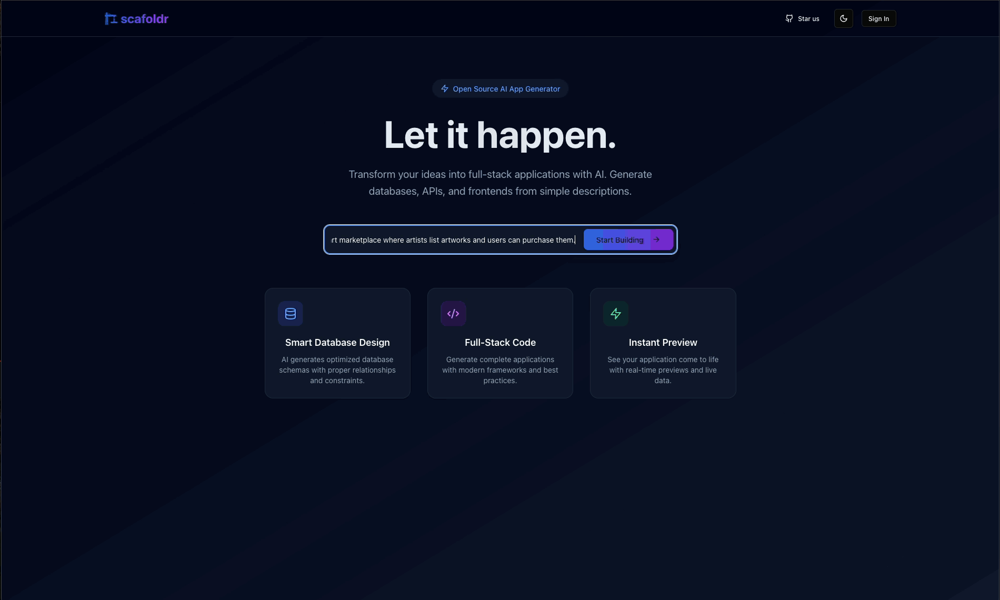
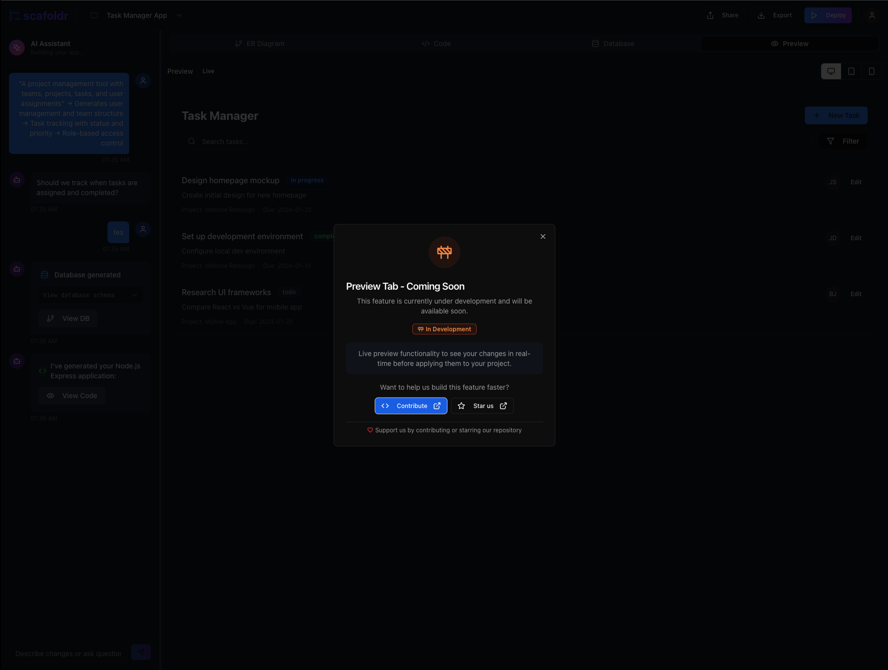

<div align="center">
  
  
  # Scafoldr
  
  **Generate full-stack applications**
  
  [](https://scafoldr.com)
  [](https://discord.gg/jZPTchaUFB)
  
  [](https://github.com/scafoldr/scafoldr)
  
  
</div>

## What is Scafoldr?

Scafoldr helps developers quickly build backend applications by generating clean, structured code from database schemas. Simply describe your project idea and our architect assistant will help you design the database schema, which is then used to generate your backend code.

We focus on **static code generation** using proven templating techniques rather than unpredictable generation methods. This ensures you get consistent, maintainable code that follows established patterns and best practices.

## How it works

Our generation process is straightforward and reliable:

1. **Schema Design**: Describe your application idea to our architect assistant, which helps you create a proper database schema in DBML format
2. **Static Generation**: Our templating engine converts your DBML schema into clean backend code using pre-built, tested templates

This two-step approach gives you the benefits of automated assistance for database design while ensuring the generated code is predictable and follows industry standards.

## Features

### 🏗️ **Schema Design Assistant**
- Chat with our architect to design your database schema
- Get suggestions for tables, relationships, and data types
- Visual diagram preview of your database structure
- Export to DBML format for code generation

### 💻 **Multi-Framework Code Generation**
- **Node.js** with Express and Sequelize
- **Java** with Spring Boot and JPA
- **Python** with FastAPI and SQLAlchemy
- Clean project structure with separation of concerns
- Ready-to-run applications with proper configuration

### 🎨 **Interactive Development**
- Live preview of generated code
- Visual database diagram editor
- Download complete projects as ZIP files
- Modern web interface with dark/light themes

*Note: Some features are still in development and will show a "Coming Soon" modal when accessed. We're actively working on expanding our capabilities.*

<div align="center">
  
  <p><em>Example of our "Coming Soon" modal for features under development</em></p>
</div>

## Getting Started

### Local development

#### With Docker (recommended)

```bash
# Clone our repo
git clone https://github.com/scafoldr/scafoldr.git

# Navigate to project directory and set up environment variables
cd scafoldr
cp .env.example .env
# Edit .env file to add your OPENAI_API_KEY (required for AI features)

# Start all services with Docker
docker compose up -d
# Once running, the app will be available at http://localhost:80
```

#### Without Docker (good if you want to run Core and Frontend separately)
For running without Docker, see alternative setup instructions:
- [Core API setup](./core/README.md)
- [Web frontend setup](./web/README.md)

### Web Interface

1. Visit [scafoldr.com](https://scafoldr.com)
2. Describe your application idea in the chat interface
3. Work with the architect assistant to refine your database schema
4. Review the generated database diagram
5. Choose your preferred backend framework
6. Download your generated project

### Example Projects

**E-commerce Platform**
```
An online store with products, categories, customers, orders, and inventory tracking"
→ Generates 8 database tables with proper relationships
→ Complete REST API with CRUD operations
→ Authentication and authorization setup
```

**Task Management System**
```
A project management tool with teams, projects, tasks, and user assignments"
→ Generates user management and team structure
→ Task tracking with status and priority
→ Role-based access control
```

## Tech Stack

- **Frontend**: Next.js, React, TailwindCSS, TypeScript
- **Backend**: Python, FastAPI, Jinja2 templating
- **Database Support**: PostgreSQL, MySQL, SQLite (COMING SOON)
- **Deployment**: Docker, Docker Compose

## Supported Frameworks

### Currently Available
- ✅ **Node.js + Express** - REST API with Sequelize ORM
- ✅ **Java + Spring Boot** - Full Spring ecosystem with JPA

### In Development
- 🔄 **Next.js** - Enterprise-grade applications
- 🔄 **Python + FastAPI** - Modern async API with SQLAlchemy

## Development Status

Scafoldr is actively developed with new features being added regularly. Some functionality may show "Coming Soon" modals as we work on implementing additional capabilities. Current focus areas include:

- Expanding framework support with Full Stack apps
- Advanced deployment options
- Team collaboration features

## Contributing

We welcome contributions! Whether you want to:

- Add support for new frameworks
- Improve existing templates
- Enhance the user interface
- Fix bugs or improve documentation

See our [Contributing Guide](./CONTRIBUTING.md) for detailed instructions.

## License

This project is licensed under the Apache License 2.0 - see the [LICENSE](LICENSE) file for details.

## Links

- **Website**: [scafoldr.com](https://scafoldr.com)
- **Documentation**: [Coming Soon]
- **Community**: [GitHub Discussions](https://github.com/scafoldr/scafoldr/discussions)
- **Discord**: [Join our Discord](https://discord.gg/jZPTchaUFB)
- **Issues**: [GitHub Issues](https://github.com/scafoldr/scafoldr/issues)

---

<div align="center">
  <p>
    <a href="https://scafoldr.com">🚀 Try Scafoldr</a> •
    <a href="https://github.com/scafoldr/scafoldr">⭐ Star on GitHub</a> •
    <a href="./CONTRIBUTING.md">🤝 Contribute</a>
  </p>
</div>
